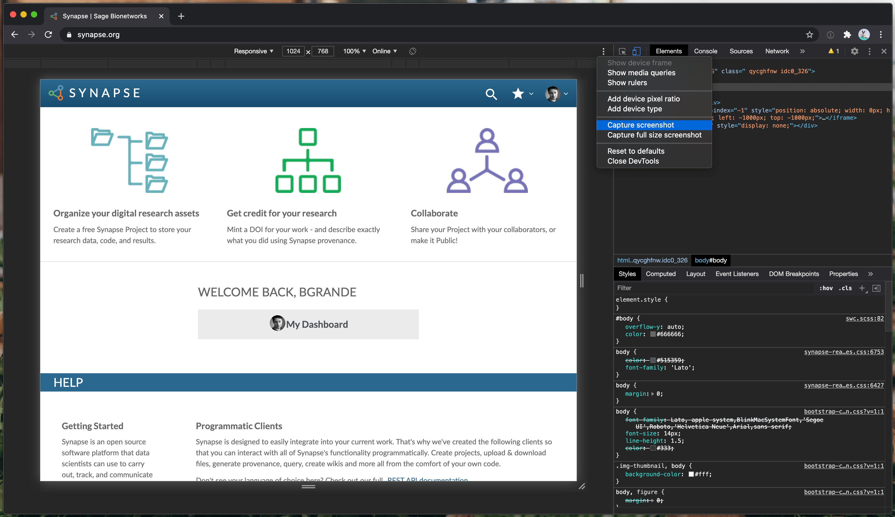

# Data Ingress Docs – Template

## Background

This repository contains the documentation for the data ingress workflow built around the [Data Curator](https://github.com/Sage-Bionetworks/data_curator) Shiny app and the [`schematic`](https://github.com/Sage-Bionetworks/schematic) backend.

The documentation is powered by [Jekyll](https://jekyllrb.com/) as a website hosted on [GitHub Pages](https://pages.github.com/). The site is built using the well-documented [`just-the-docs`](https://pmarsceill.github.io/just-the-docs/) Jekyll theme.

To ease deployment of this documentation for various projects, we are leveraging [Liquid templating](https://jekyllrb.com/docs/liquid/).

## Deployment

1. Fork the repository, typically under a community-specific GitHub organization.

2. Update placeholder values in the Jekyll configuration file, `_config.yml`.

3. Push any changes to your repository fork, which should result in the public-facing website to be updated within a few minutes.

## Local Testing

The following steps allow you to test/preview the documentation website locally using a Docker container. The contents will automatically be updated as you change the Markdown files. 

1. Install Docker and `docker-compose`.

2. Run `docker-compose up` from within repository to launch Jekyll Docker container.

3. Access the local preview of the documentation at http://127.0.0.1:4000.

**N.B.** Any changes to the `_config.yml` file will not be reflected in the website; you will need to stop the container with Ctrl-C and relaunch it with `docker-compose up`.

## Screenshots

For future reference, the screenshots were taken using the Developer Tools in Google Chrome at a resolution of 1024 x 768. Most screenshots were cropped from the bottom to remove empty space or needless details (like the timestamps at the bottom of Synapse entity pages). After cropping, the resulting PNG images were [compressed](https://compresspng.com/) to minimize file size by roughly 70-75% before committing the files to Git.

