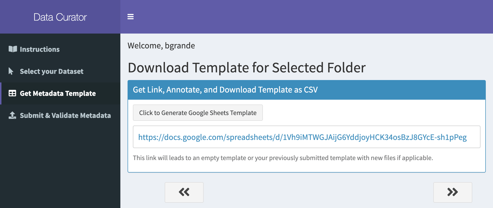
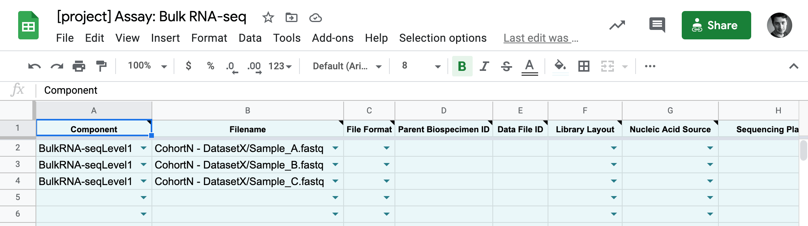

# Generate a New Metadata Template for the First Time

## Pre-requisites

- You are a [certified user on Synapse](https://docs.synapse.org/articles/accounts_certified_users_and_profile_validation.html#certified-users).
- You have [uploaded your dataset to the DCC](uploading-data).

## Step-by-Step
    
> In this how-to, we'll be using an example `Assay: Bulk RNA-seq` dataset named `CohortN - DatasetX` located in a Synapse Project called `CenterA`.
    

 
6. Click on the generated link to open a Google spreadsheet containing an empty template for you to complete with metadata, for each file in your dataset.

    [{:.screenshot}](images/screenshots/curator-link-after-1.png)

7. You can fill out the sheet on the web, using dropdowns with allowed values and other standard Google Sheets features.

    [{:.screenshot}](images/screenshots/gsheets-new-before.png)

[Next: Step 3 - Annotate and Submit Your Metadata](step-3){: .btn }