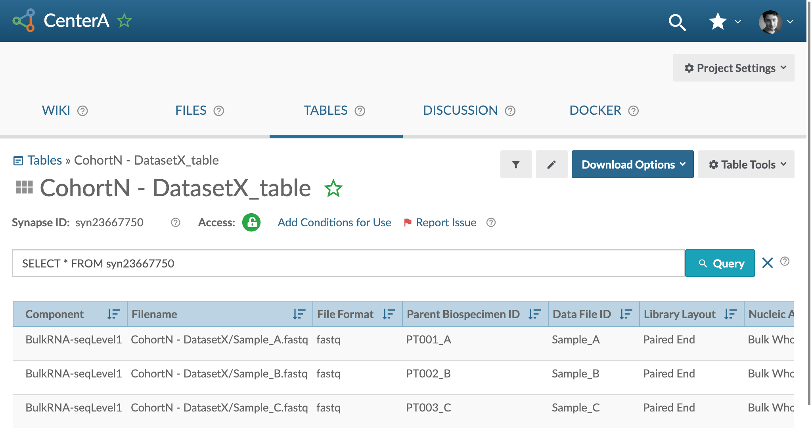

# Step 3 - Annotate and Submit Your Metadata Overview

Continuing with the [Data Curator App]({{ site.aux_links["Go To Data Curator"][0] }}){:target="_blank"}, the metadata:

- Can be pre-filled when applicable and RFC-defined attributes are included 
- Can be filled in and stored offline
- Will be validated & associated with the selected dataset on submission

## Step-by-Step

Continuing on from [Step 2 - Request a Metadata Template](step-2), you can annotate and submit your metadata.

1. Clicking on the generated template link will open up the template in Google Sheets

    [{:.screenshot}](images/screenshots/curator-link-after-1.png)

2. You can fill in the templates by selecting the available variables in each cell's dropdown menu. For cells that don't have a drop down, you can type in the appropriate value. 
    
    [{:.screenshot}](images/screenshots/gsheets-new-before.png)

3. **Required** metadata is highlighted in light green, whereas optional values are in yellow. _Conditionally required_ elements can also appear as you fill out the template.  

    [{:.screenshot}](images/screenshots/gsheets-new-error.png)

    - _**Note**: you can also save the spreadsheet as a CSV file and use a method of your choice to fill it out. The metadata CSV will be validated by the Data Curator app before submission regardless of the method used to fill out the template._

4. Once you've filled in the template, you can save your spreadsheet as a CSV (File -> Download -> Comma-separated Values...)

    [{:.screenshot}](images/screenshots/gsheets-new-export.png)

5. Next, go gack to the [Data Curator App]({{ site.aux_links["Go To Data Curator"][0] }}){:target="_blank"} and navigate to the "Submit & Validate Metadata" step in the left-hand sidebar. 

    [{:.screenshot}](images/screenshots/curator-validate-before.png)

6. Click on the "Browse" button to upload your saved CSV. You will be shown a preview of your file in the panel below the upload bar. 

    [{:.screenshot}](images/screenshots/curator-validate-new-after.png)

7. To validate your CSV, click the "**Validate Metadata**" button. 

8. If you receive an error upon pressing the "**Validate Metadata**" button, the metadata template-cells causing the error will be highlighted, along with a corresponding list of error details. You will also get a message letting you know that you can "Edit your data locally or **on Google Sheets**". Clicking "**on Google Sheets**" will re-open the file for you on the web to edit. Once you've resolved the errors, repeat steps 4-7 to validate the updated file. 

    [{:.screenshot}](images/screenshots/curator-validate-new-error.png)

    [{:.screenshot}](images/screenshots/gsheets-new-fixed.png)

9. If the template has been filled out correctly, you will see a "**Your metadata is valid!**" message and the "**Submit to Synapse**" button will become clickable.

    [{:.screenshot}](images/screenshots/curator-validate-fixed-after.png)

10. Click on the "**Submit to Synapse**" button.

    [{:.screenshot}](images/screenshots/curator-validate-submitting.png)

11. You will receive a "**Success!**" notification once the metadata has finished uploading to Synapse and confirms that the dataset has been curated according to the relevant DCC  data model. You will also get a link to your metadata file in Synapse. 

    [{:.screenshot}](images/screenshots/curator-validate-fixed-success.png)

  
#### Please contact your [DCC liaison](dcc-liaison) if you cannot resolve a metadata error; or have questions regarding metadata submission.

## Verify That Your Metadata Has Successfully Submitted

You can verify that both your dataset and metadata have been successfully submitted to the DCC by navigating to the Synapse project containing your dataset. The link to the project was provided by your DCC liaison in Step 1.  A link to where your metadata file lives is generated by the Data Curator App upon successful submission of your metadata. 

[{:.screenshot}](images/screenshots/synapse-manifest.png)

You can also see your metadata in a table by navigating to the `Tables` tab of your project. There would be a table with your dataset name which you can query and view.

[{:.screenshot}](images/screenshots/synapse-dataset-table-before.png)

Congrats! 
{: .label .label-green }

You've successfully uploaded your data and metadata to Synapse!
