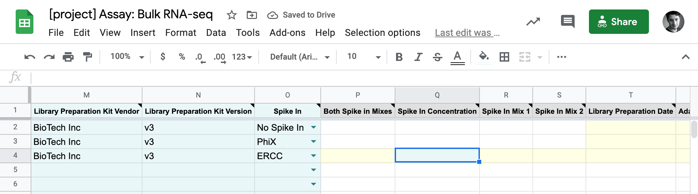
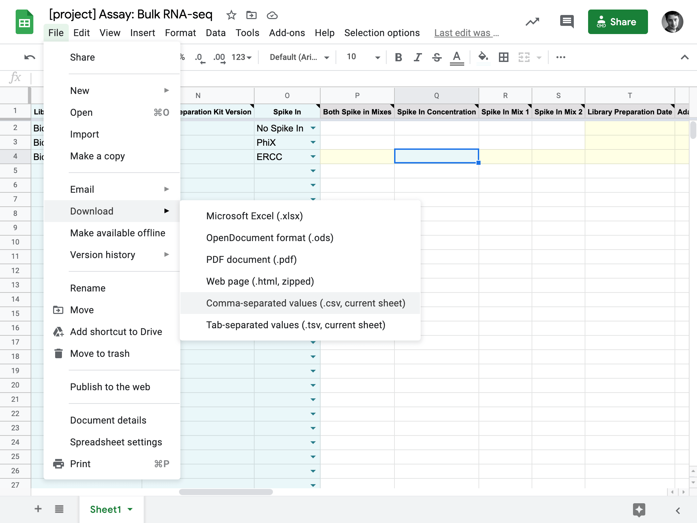
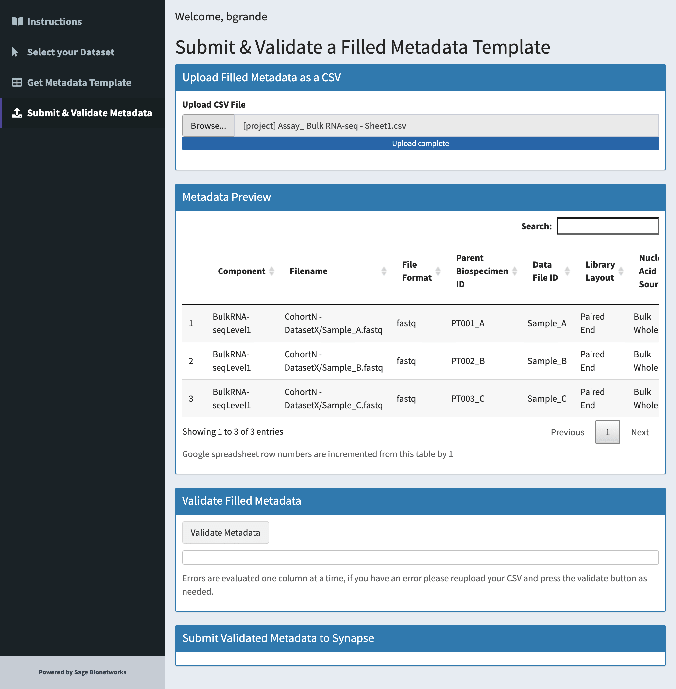
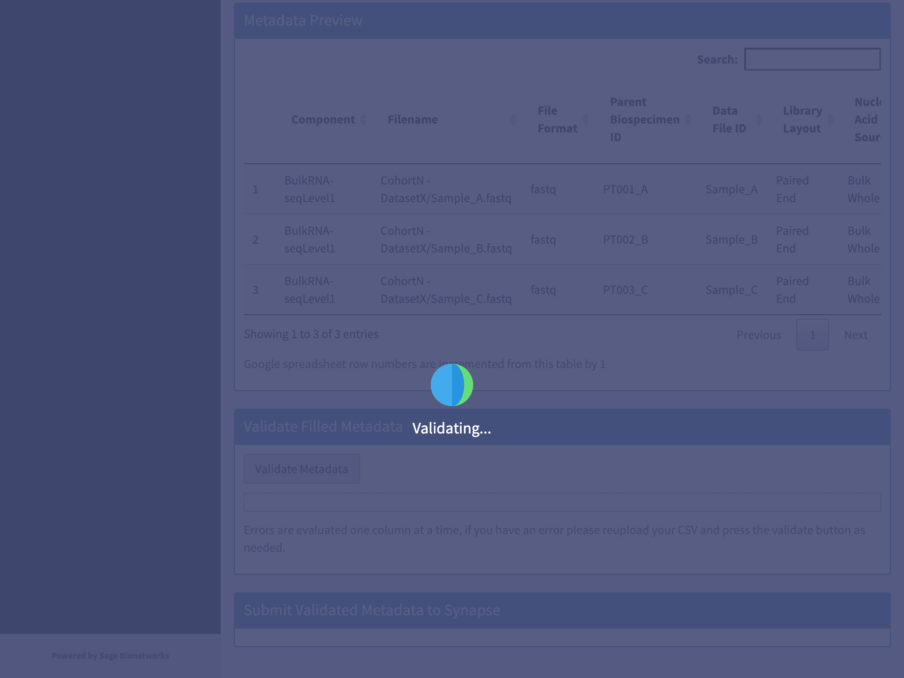
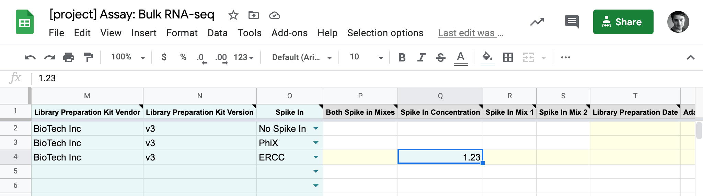
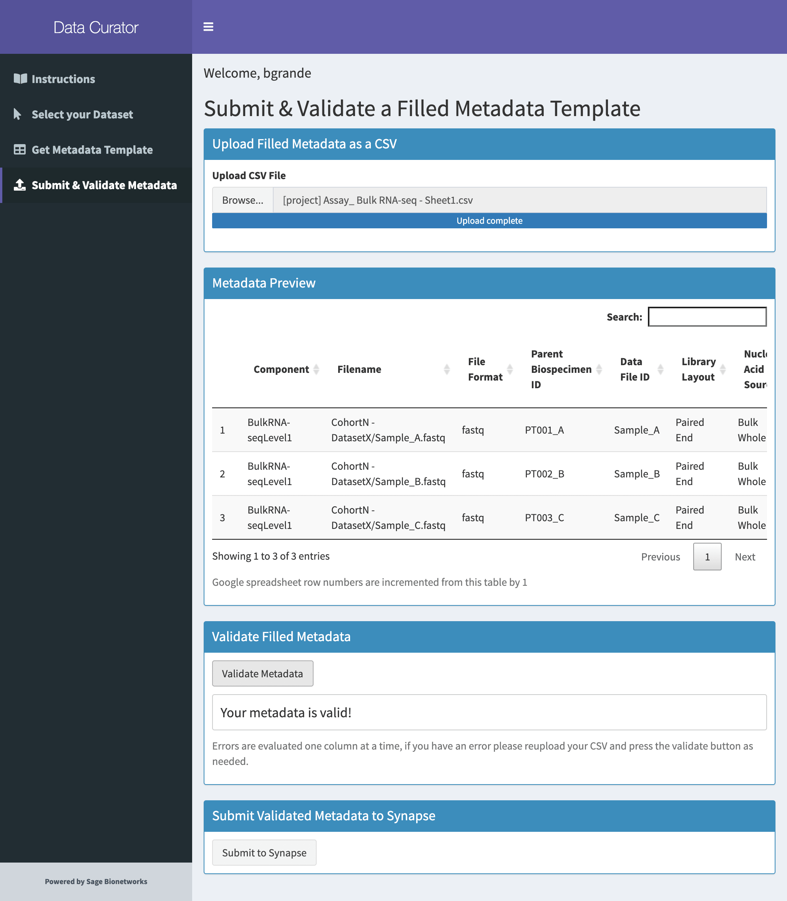
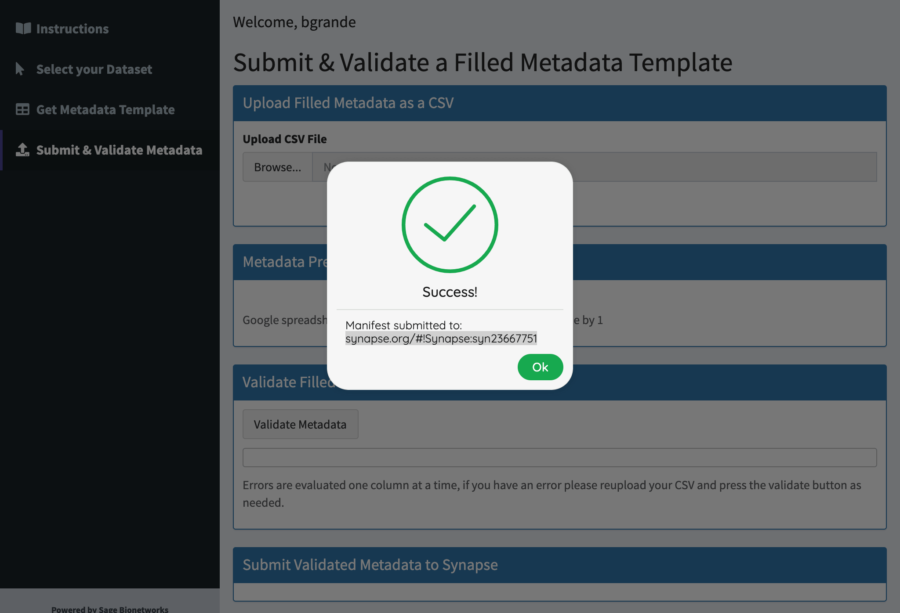
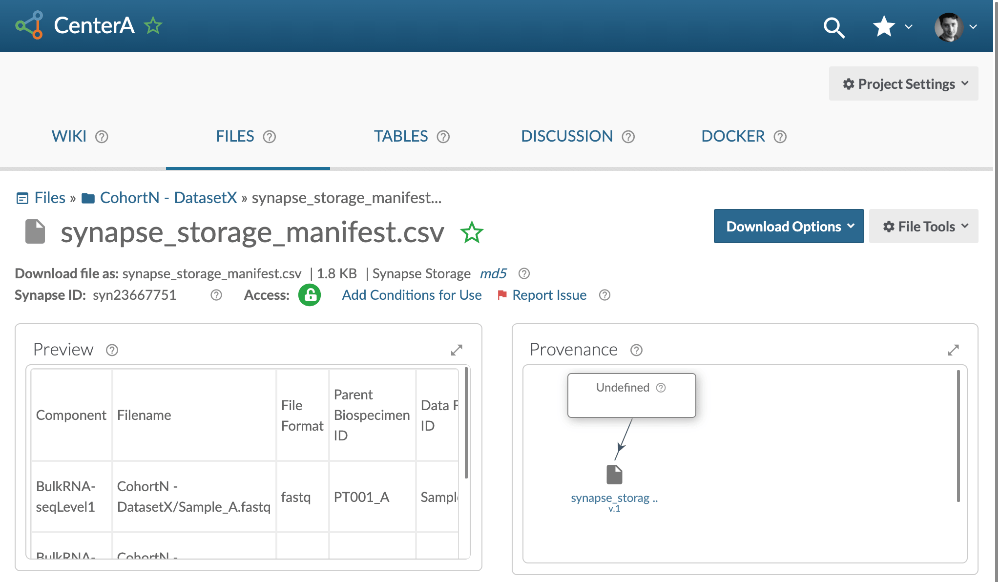

# Step 3 - Annotate and Submit Your Metadata Overview

Continuing with the [Data Curator App]({{ site.aux_links["Data Curator"][0] }}){:target="_blank"}, the metadata:

- Can be pre-filled when applicable and attributes are included 
- Can be filled in and stored offline
- Will be validated & associated with the selected dataset on submission

## Step-by-Step

Continuing on from [Step 2 - Request a Metadata Template](step-2), you can annotate and submit your metadata.

1. Click on the generated link to open the metadata template in Google Sheets.

    [{:.screenshot}](images/screenshots/curator-link-after-1.png)

2. You can fill in the template by selecting the available values from the dropdown menu for each cell. For cells that don't have a dropdown menu, you can type in the appropriate value. 
    - **Note**: You can also download the spreadsheet as a CSV file and use a method of your choice to fill it out. The metadata CSV file will be validated by the Data Curator before submission regardless of the method used to fill out the template.
    
    [{:.screenshot}](images/screenshots/gsheets-new-before.png)

3. _Required metadata_ will be highlighted in light green on a row-by-row basis, whereas _optional metadata_ are in shaded in yellow. _Conditionally required_ elements can also appear as you fill out the template (as in the screenshot below given the value of "ERCC" in the "**Spike In**" column). 

    [{:.screenshot}](images/screenshots/gsheets-new-error.png)

4. If completed in Google Sheets, download the manifest template as a CSV file once it's been filled in (File -> Download -> Comma-separated values).

    [{:.screenshot}](images/screenshots/gsheets-new-export.png)

5. Back in the [Data Curator]({{ site.aux_links["Data Curator"][0] }}){:target="_blank"}, navigate to the "**Submit & Validate Metadata**" section in the left-hand menu. 

    [{:.screenshot}](images/screenshots/curator-validate-before.png)

6. Click on the "**Browse**" button to upload your CSV file, and check the preview of your file to make sure everything looks correct. 

    [{:.screenshot}](images/screenshots/curator-validate-new-after.png)

7. Validate your CSV file by clicking the "**Validate Metadata**" button. 

    <!-- [{:.screenshot}](images/screenshots/curator-validate-new-validating.png) -->

8. If you receive a validation error, the cells in the metadata template that are causing the error will be highlighted in yellow, and a corresponding list of error will be detailed below the metadata preview. 
    - You will also get a message letting you know that you can "Edit your data locally or **on Google Sheets**". Clicking "**on Google Sheets**" will re-open the file for you on the web to edit. Once you've resolved the errors, repeat the last few steps to re-upload and validate the updated metadata CSV file. 

    [{:.screenshot}](images/screenshots/curator-validate-new-error.png)

    [{:.screenshot}](images/screenshots/gsheets-new-fixed.png)

9. If the template has been filled out correctly, you will see a "**Your metadata is valid!**" message and the "**Submit to Synapse**" button will become clickable.

    [{:.screenshot}](images/screenshots/curator-validate-fixed-after.png)

10. Click on the "**Submit to Synapse**" button.

    <!-- [{:.screenshot}](images/screenshots/curator-validate-submitting.png) -->

11. You will receive a "**Success!**" notification once the metadata has finished uploading to Synapse and confirms that the dataset has been curated according to the relevant DCC  data model. You will also get a link to your metadata file in Synapse. 

    [{:.screenshot}](images/screenshots/curator-validate-fixed-success.png)

**Please contact your [DCC liaison](dcc-liaison) if you cannot resolve a metadata error or have questions regarding metadata updates and submission.**

## Verify That Your Metadata Has Successfully Submitted

You can verify that both your dataset and metadata have been successfully submitted to the DCC by navigating to the Synapse project containing your dataset. The link to the project was provided by your DCC liaison in Step 1.  A link to where your metadata file lives is generated by the Data Curator App upon successful submission of your metadata. 

[{:.screenshot}](images/screenshots/synapse-manifest.png)

Congrats! 
{: .label .label-green }

You've successfully uploaded your data and metadata to Synapse!
