# Update Existing Metadata

#### Pre-requisites
- You are a [certified user on Synapse](https://docs.synapse.org/articles/accounts_certified_users_and_profile_validation.html#certified-users)
- You have [transferred your dataset to the DCC](uploading-data)

## Step-by-Step

Now you'd like to update your metadata in order to:
   
   * correct mistake(s) 
   * provide further/change metadata to comply with a new iteration of the DCC data model affecting your datasets' metadata
   * provide metadata for files that have been added to your dataset

_In this how-to, we'll be using an example `Assay: Bulk RNA-seq` dataset named `CohortN - DatasetX` located in a Synapse Project called `CenterA`. This is a dataset that's been annotated previously._      

1. Access the [Data Curator app](https://www.synapse.org/#!Wiki:syn20681266/ENTITY)
    - If you are prompted to login to Synapse, please use your Synapse account (or associated Google account).
    
  
2. In the app, go to the "**Select Your Dataset**" section in the left-hand menu. From that page, select your project from the dropdown. 
    - The project name corresponds to the bucket name (here `CenterA`).  

   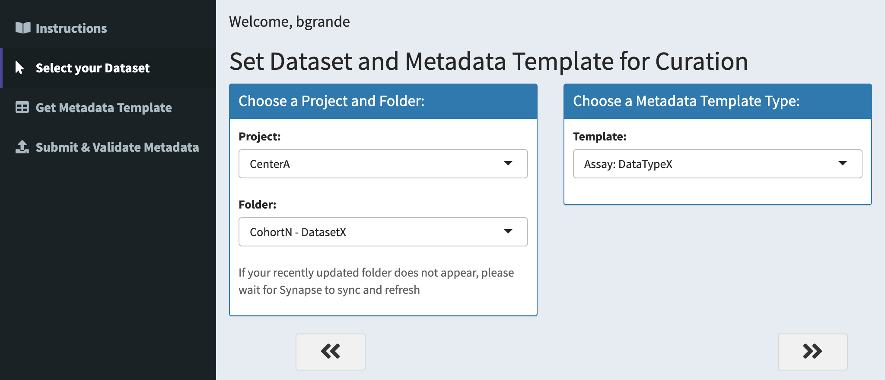{: .screenshot}
    
3. Next, select your dataset, which corresponds to the folder name in your bucket (here `CohortN - DatasetX`).

   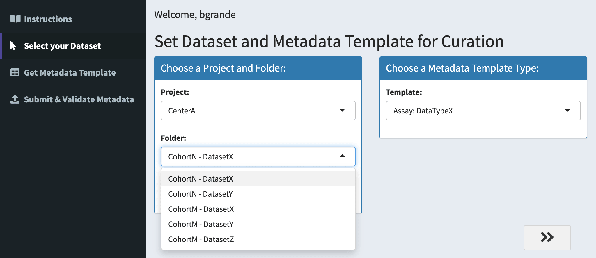{: .screenshot}

4. Then, select the metadata template you would like to use (here `Assay: Bulk RNA-seq`). If you don't see the correct template for your dataset, you can select the "Minimal Metadata" template and [contact your DCC liaison](step-1).

   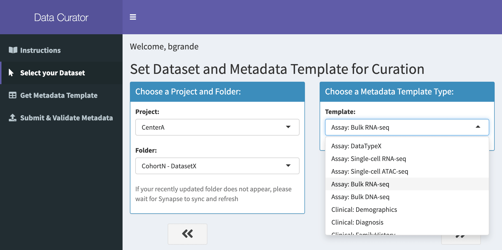{: .screenshot}

5. Once you have selected your dataset and metadata template, navigate to the "*Get Metadata Template*" section in the left-hand menu. Select the "*Click to Generate Google Sheets Template*" button. 
    - This will generate a link to a Google spreadsheet containing an empty template for you to complete with metadata, for each of the files in your dataset. This can take awhile depending on how many files are in your folder, so please be patient!

   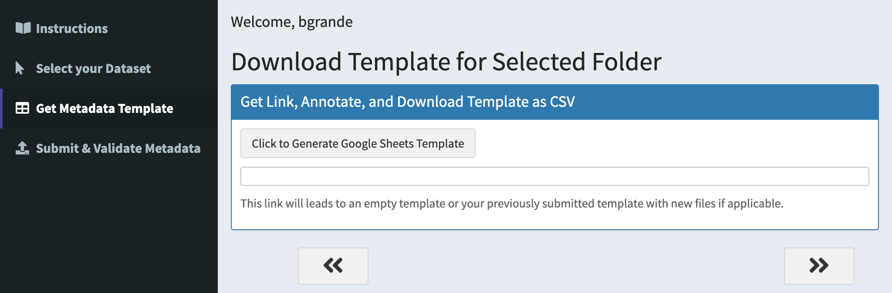{: .screenshot}

   {: .screenshot}

6. Clicking on the generated template link will open up the template in Google Sheets.

   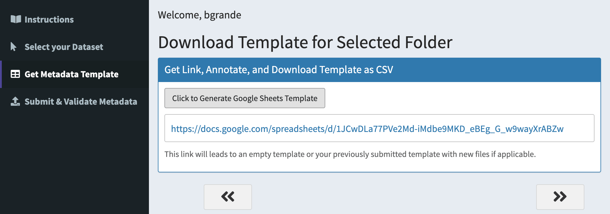{: .screenshot}

7. All previously validated metadata is available.

      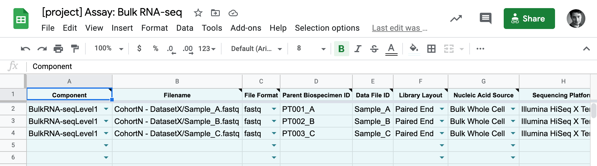{: .screenshot}

8. Add a new row (in this case, a participant), but it can be other new information. 
   
   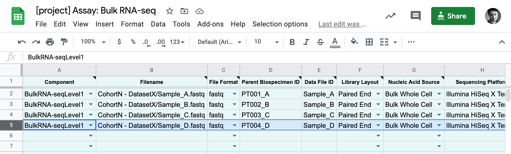{: .screenshot}

    - _**Note**: you can also save the spreadsheet as a CSV file and use a method of your choice to fill it out. The metadata CSV will be validated by the Data Curator app before submission regardless of the method used to fill out the template._

9. Once you've filled in the template, you can save your spreadsheet as a CSV (File -> Download -> Comma-separated Values...)

   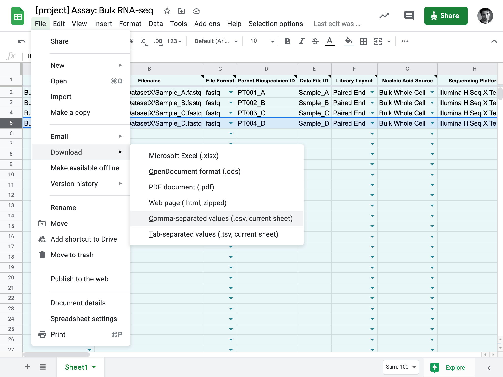{: .screenshot}

10. Next, go gack to the [Data Curator App](https://www.synapse.org/#!Wiki:syn20681266/ENTITY) and navigate to the "Submit & Validate Metadata" step in the left-hand sidebar. Click on the "Browse" button to upload your saved CSV. 

   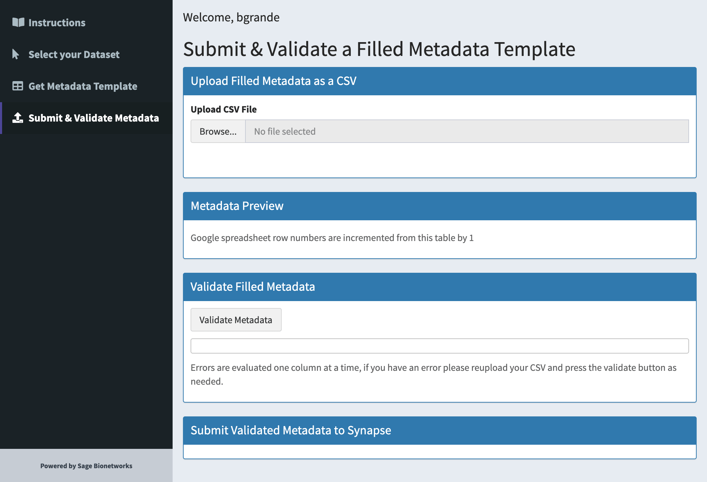{: .screenshot}

11. Check the preview of your file to make sure everything looks correct. 

   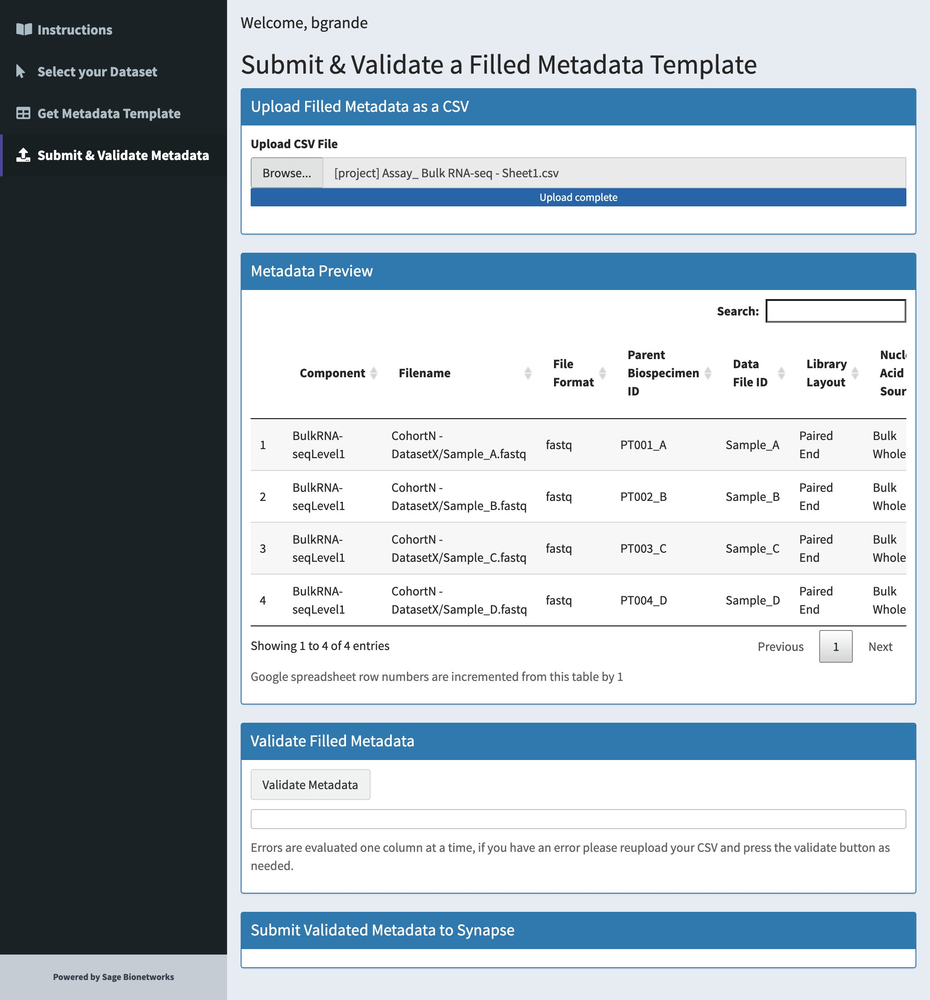{: .screenshot}

12. Validate your CSV by clicking the "**Validate Metadata**" button. 

13. Once validated, you can submit by clicking on the "**Submit to Synapse**" button.
   
   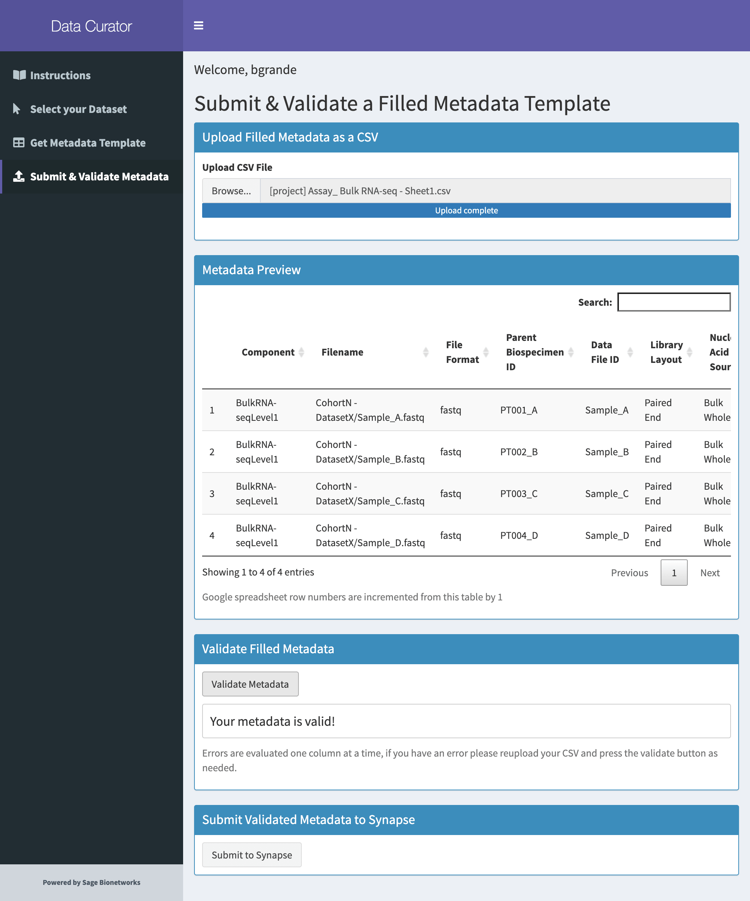{: .screenshot}
   
   {: .screenshot}

15. Success! 
   
      {: .screenshot}

16. Check your metadata on Synapse. A link to where your metadata file lives is generated by the Data Curator App upon successful submission of your metadata. 

17. See your metadata in a table. You can also see your metadata in a table by navigating to the `Tables` tab of your project. There would be a table with your dataset name which you can query and view.

   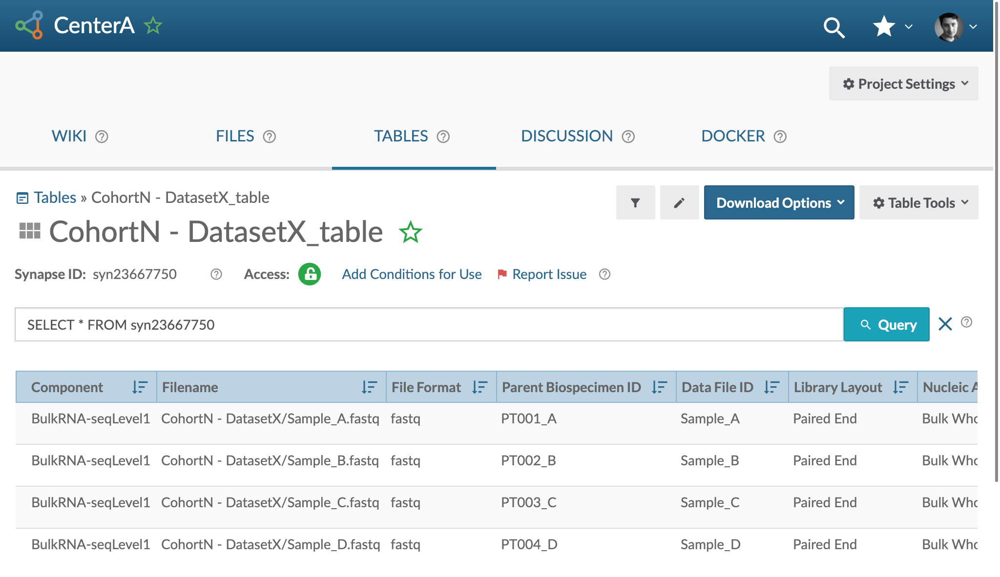{: .screenshot}

**Please contact your [DCC liaison](dcc-liaison) if you cannot resolve a metadata error or have questions regarding metadata updates and submission.**

