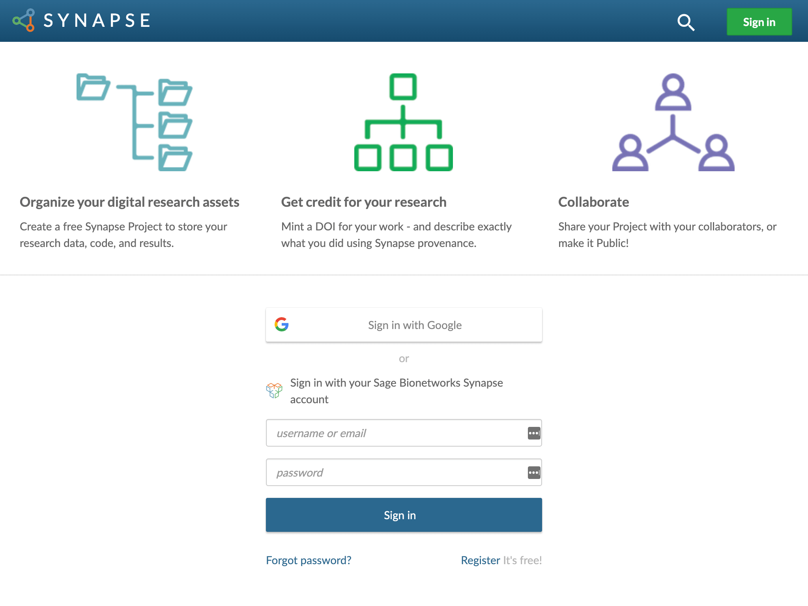
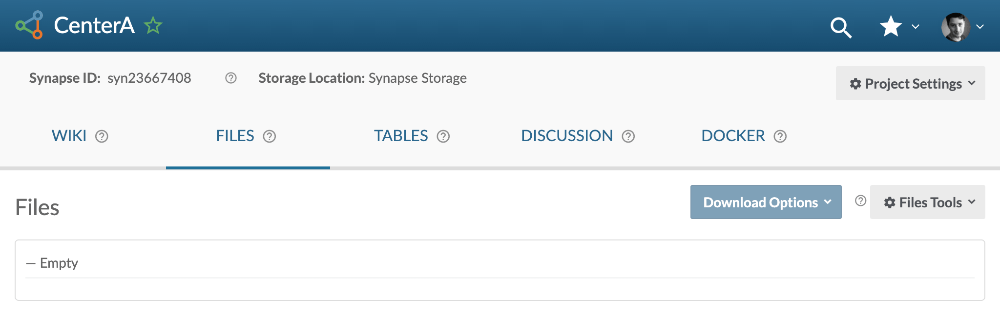
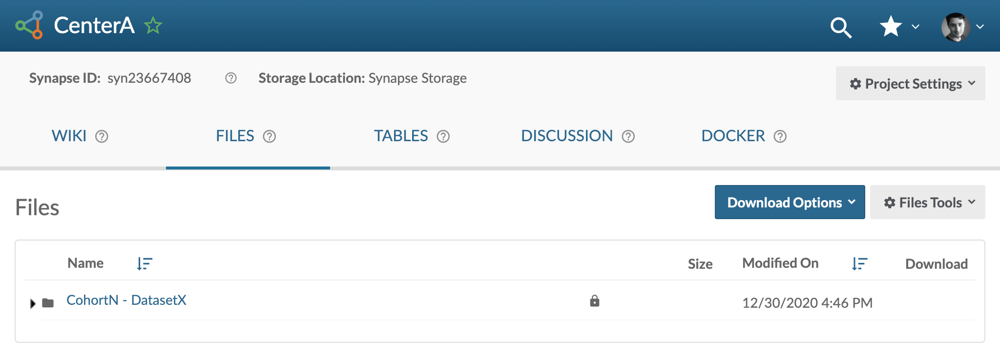
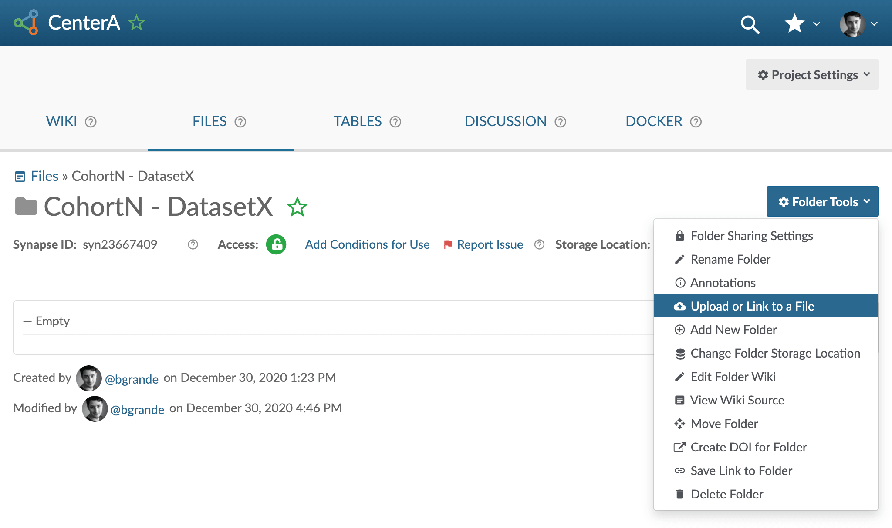
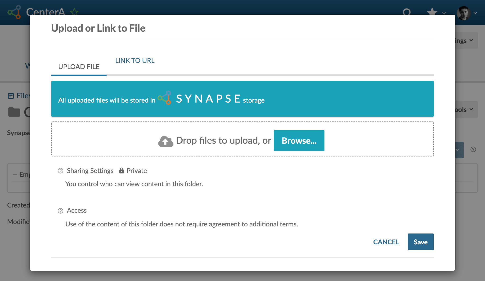
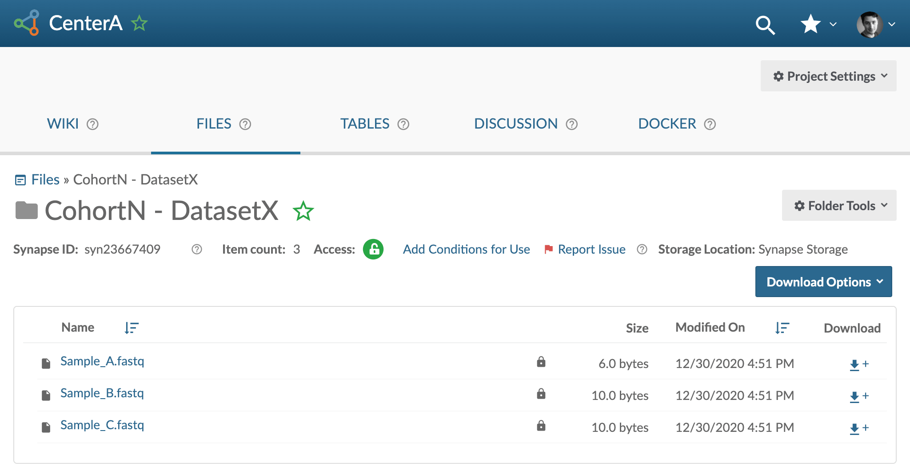

# Uploading Data Using the Web Interface

#### Requirements
- You are a [certified user on Synapse](https://docs.synapse.org/articles/accounts_certified_users_and_profile_validation.html#certified-users)
- You have contacted your [DCC Liaison](dcc-liaison) and they've provided you with your Synapse Project location

This option would typically be useful for uploading files residing on your local machine to a Synapse cloud storage location. You can follow the steps outlined below to complete a data upload.

## Step-by-Step

1. Navigate to your project, using the Synapse link provided by your DCC liaison
   - If prompted, please login with your Synapse account (or an associated Google account).
 
   [{:.screenshot}](images/screenshots/synapse-login.png)

2. Create a folder to store your first dataset.
   - Go to the Files tab 

   [{:.screenshot}](images/screenshots/synapse-project-before.png)
    
   - Create a folder (click on Files Tools -> Add New folder) 
   
   [{:.screenshot}](images/screenshots/synapse-project-after.png)

3. Go to your folder and upload the files from your dataset (click on Folder Tools -> Upload or Link to a File)
   
   [{:.screenshot}](images/screenshots/synapse-dataset-before.png)
   
   [{:.screenshot}](images/screenshots/synapse-dataset-upload.png)

4. Once uploaded you can preview your files:
   
   [{:.screenshot}](images/screenshots/synapse-dataset-after.png)
